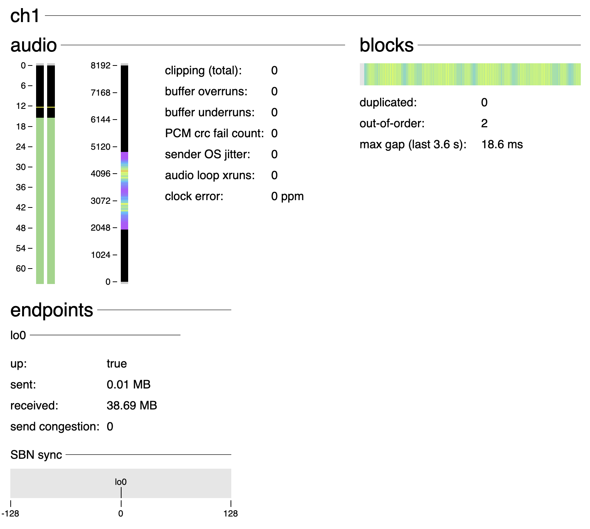

# waterslide

Real-time network protocol with forward error correction and multihoming (blending of data from multiple networks).

## Potential applications

- Remote recording studio collaboration or rehearsal
- Low latency wireless monitoring over 5 GHz WiFi
- Transporting lightly compressed (visually lossless) video over redundant multiple networks

## Features (implemented and to-do)

- [x] High bitrate Opus compressed audio transport
- [x] Forward error correction (no waiting for packet re-transmissions)
- [x] Works over the internet (cellular) and on a LAN
- [x] Multihoming
- [x] Lossless audio
- [x] Multi-channel audio
- [x] Resampling to correct for clock drift between sender and receiver
- [x] Encryption
- [x] Network discovery
- [ ] IPv6

## Anti-features

- Automatically reducing bitrate or increasing latency when the stream is bad
- Doing any kind of audio processing that would alter the sound
- Warping the received audio to allow "catch up" after significant packet loss

## Platforms

- macOS x64
- macOS ARM
- Raspberry Pi
- Linux x86_64

## Setup (common)

1. Install Node.js 20.x.x and npm 10.x.x

2. Run
```sh
git clone https://github.com/sfjohnson/waterslide.git
cd waterslide
./pull-deps.sh
```

## Setup (macOS specific)

Supported platforms: macOS >= 12

1. Install Homebrew
2. Run
```sh
brew install openssl@3
brew install llvm@15
```

## Build macOS (binary only)

Native compile for either Intel or Apple silicon

```sh
make -f macos.mk
```

## Build Raspberry Pi 64-bit (binary only)

Cross compile, runs only on Linux x86_64

```sh
make -f rpi-arm64.mk
```

## Build Linux x86_64 (binary only)

Native compile

```sh
make -f linux-x64.mk
```

## Build macOS (distributable tar)

1.
```sh
./make-macos-dist.sh
```
2. Copy `waterslide-macos-arm64-dist.tar.bz2` or `waterslide-macos-x64-dist.tar.bz2` to the target and extract.
3. Run frontend script:
```sh
cd waterslide-macos-<ARCH>-dist
./waterslide OPTION CONFIG
```
4. Open `http://localhost:<UI_PORT>` in a browser. `UI_PORT` is in the log: `Serving monitor on port <UI_PORT>`.

## Frontend

The frontend is a small TypeScript/Node.js app that provides config to the waterslide binary (which is built using `make` above).

### Build frontend

```sh
cd frontend
npm ci
npm run build
```

Built files go to the `frontend/out` folder.

### Run frontend

Usage (distributable tar):
```sh
./waterslide OPTION CONFIG
```

Usage (development):
```sh
npm start -- OPTION CONFIG
```

Options:
```
-f JSON_FILE      Read config from a JSON file and launch waterslide.
-p PROTOBUF       Read config from a Base64 encoded protobuf message
                  literal that was encoded by init-config.proto and
                  launch waterslide.
-e JSON_FILE      Encode a JSON file using init-config.proto and output
                  the message as Base64, without launching waterslide.
```

## Discovery server

For use over the internet, make sure inbound UDP port 26172 is open. This port can be changed by changing `SERVER_BIND_PORT` in `discovery-server/main.c`. The environment variable `PEER_EXPIRY_TIME` (in microseconds) can be set to change the interval between a peer contacting the server and that peer being removed from the server's discovery list.

## Example configs

Audio and video config for both sender and receiver are contained only in sender config. Once receiver gets its audio and video config from channel 0, it can then start decoding other channels to receive audio and video data. Initial receiver config is minimal: networking, and FEC layout for channel 0 (config channel).

See `protobufs/init-config.proto` and `include/globals.h` for more information.

TODO: update and document configs

### Sender (PCM, Mi A3 internal mic to macOS)

```json
{
  "mode": 1,
  "privateKey": "abcdefghijklmnopqrstuvwxyzABCDEFGH012345679=",
  "peerPublicKey": "abcdefghijklmnopqrstuvwxyzABCDEFGH012345679=",
  "discovery": {
    "serverAddr": [10, 10, 10, 10],
    "serverPort": 26172
  },
  "endpoints": [
    {
      "interface": "wlan0"
    }
  ],
  "mux": {
    "maxPacketSize": 1500
  },
  "audio": {
    "networkChannelCount": 2,
    "pcm": {
      "frameSize": 240,
      "networkSampleRate": 48000
    },
    "sender": {
      "deviceSampleRate": 48000,
      "decodeRingLength": 8192,
      "linux": {
        "cardId": 0,
        "deviceId": 0,
        "deviceChannelCount": 2,
        "bitsPerSample": 16,
        "periodSize": 128,
        "periodCount": 8,
        "loopSleep": 2000,
        "controls": [
          {
            "id": 20,
            "intValues": { "values": [1] }
          }, {
            "id": 21,
            "intValues": { "values": [1] }
          }, {
            "id": 44,
            "enumValue": "ADC0"
          }, {
            "id": 45,
            "enumValue": "ADC2"
          }, {
            "id": 52,
            "enumValue": "SWR_MIC"
          }, {
            "id": 53,
            "enumValue": "SWR_MIC"
          }, {
            "id": 83,
            "enumValue": "DEC0"
          }, {
            "id": 1222,
            "intValues": { "values": [1, 0] }
          }, {
            "id": 3345,
            "enumValue": "Two"
          }, {
            "id": 3357,
            "enumValue": "S16_LE"
          }, {
            "id": 3467,
            "enumValue": "INP3"
          }, {
            "id": 3468,
            "intValues": { "values": [1] }
          }, {
            "id": 3469,
            "intValues": { "values": [1] }
          }
        ]
      },
      "levelSlowAttack": 0.004,
      "levelSlowRelease": 0.0008,
      "levelFastAttack": 0.31,
      "levelFastRelease": 0.00003
    },
    "receiver": {
      "deviceSampleRate": 48000,
      "decodeRingLength": 8192,
      "macos": {
        "deviceName": "waterslide"
      },
      "levelSlowAttack": 0.004,
      "levelSlowRelease": 0.0008,
      "levelFastAttack": 0.31,
      "levelFastRelease": 0.00003
    }
  },
  "fec": [
    {
      "chId": 0,
      "symbolLen": 128,
      "sourceSymbolsPerBlock": 1,
      "repairSymbolsPerBlock": 2
    },
    {
      "chId": 1,
      "symbolLen": 256,
      "sourceSymbolsPerBlock": 6,
      "repairSymbolsPerBlock": 3
    }
  ],
  "monitor": {
    "uiPort": 8081,
    "wsPort": 7681
  }
}
```

### Sender (Opus, macOS to Mi A3 headphone jack)

Note: adjusting volume requires additional ALSA mixer control(s) which are different for each chip.

```json
{
  "mode": 1,
  "privateKey": "abcdefghijklmnopqrstuvwxyzABCDEFGH012345679=",
  "peerPublicKey": "abcdefghijklmnopqrstuvwxyzABCDEFGH012345679=",
  "discovery": {
    "serverAddr": [10, 10, 10, 10],
    "serverPort": 26172
  },
  "endpoints": [
    {
      "interface": "en0"
    }
  ],
  "mux": {
    "maxPacketSize": 1500
  },
  "audio": {
    "networkChannelCount": 2,
    "opus": {
      "bitrate": 256000,
      "frameSize": 240
    },
    "sender": {
      "deviceSampleRate": 48000,
      "decodeRingLength": 2048,
      "macos": {
        "deviceName": "waterslide"
      },
      "levelSlowAttack": 0.004,
      "levelSlowRelease": 0.0008,
      "levelFastAttack": 0.31,
      "levelFastRelease": 0.00003
    },
    "receiver": {
      "deviceSampleRate": 48000,
      "decodeRingLength": 8192,
      "linux": {
        "cardId": 0,
        "deviceId": 0,
        "deviceChannelCount": 2,
        "bitsPerSample": 32,
        "periodSize": 32,
        "periodCount": 8,
        "loopSleep": 300,
        "controls": [
          {
            "id": 77,
            "enumValue": "AIF1_PB"
          }, {
            "id": 78,
            "enumValue": "AIF1_PB"
          },{
            "id": 94,
            "enumValue": "CLSH_DSM_OUT"
          },{
            "id": 95,
            "enumValue": "CLSH_DSM_OUT"
          },{
            "id": 99,
            "enumValue": "RX0"
          },{
            "id": 102,
            "enumValue": "RX1"
          },{
            "id": 1032,
            "intValues": { "values": [1, 0] }
          }, {
            "id": 3336,
            "enumValue": "Two"
          }, {
            "id": 3349,
            "enumValue": "S32_LE"
          }, {
            "id": 3361,
            "enumValue": "KHZ_48"
          },{
            "id": 3473,
            "intValues": { "values": [1] }
          }, {
            "id": 3474,
            "intValues": { "values": [1] }
          }
        ]
      },
      "levelSlowAttack": 0.004,
      "levelSlowRelease": 0.0008,
      "levelFastAttack": 0.31,
      "levelFastRelease": 0.00003
    }
  },
  "fec": [
    {
      "chId": 0,
      "symbolLen": 128,
      "sourceSymbolsPerBlock": 1,
      "repairSymbolsPerBlock": 2
    },
    {
      "chId": 1,
      "symbolLen": 256,
      "sourceSymbolsPerBlock": 2,
      "repairSymbolsPerBlock": 1
    }
  ],
  "monitor": {
    "uiPort": 8081,
    "wsPort": 7681
  }
}
```

### Receiver

```json
{
  "mode": 0,
  "privateKey": "abcdefghijklmnopqrstuvwxyzABCDEFGH012345679=",
  "peerPublicKey": "abcdefghijklmnopqrstuvwxyzABCDEFGH012345679=",
  "discovery": {
    "serverAddr": [10, 10, 10, 10],
    "serverPort": 26172
  },
  "endpoints": [
    {
      "interface": "wlan0"
    }
  ],
  "mux": {
    "maxPacketSize": 1500
  },
  "fec": [
    {
      "chId": 0,
      "symbolLen": 128,
      "sourceSymbolsPerBlock": 1,
      "repairSymbolsPerBlock": 2
    }
  ],
  "monitor": {
    "uiPort": 8082,
    "wsPort": 7682
  }
}
```

## Monitor

The C/C++/Rust code runs a WebSocket server that provides live data. An interface called the monitor connects to this server and provides audio meters, timing graphs, and detailed information on the status and health of the stream.

Note: monitor redesign coming soon!



### Dev server

1. Copy `protobufs/monitor.proto` to the `monitor/public` folder.
2.
```sh
cd monitor
npm run dev
```
3. Go to http://localhost:5173
4. If waterslide is started or restarted, refresh the page.
5. in `monitor/src/App.svelte` the address of the WebSocket server can be changed for monitoring a remote device running waterslide.

## Licensing

Licenses for dependencies are in the `licenses` folder (after running `./pull-deps.sh`). Contributions to dependencies are made under each dependency's specific license. All other code is licensed under MPL-2.0. Contributions to this repository are made under MPL-2.0.

This software uses an implementation of RaptorQ (RFC 6330). Use of this software must adhere to Qualcomm's conditions, see here: https://datatracker.ietf.org/ipr/2554/
